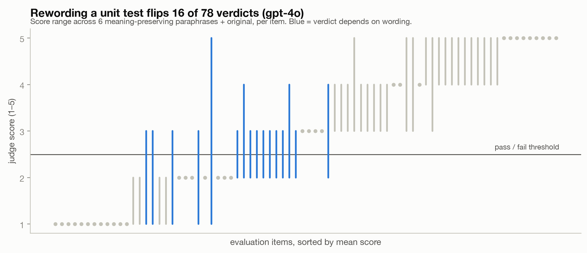
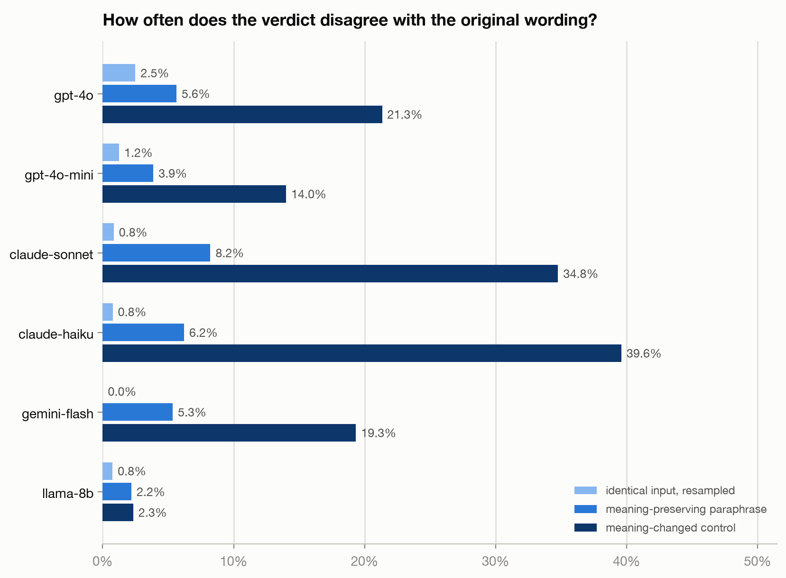
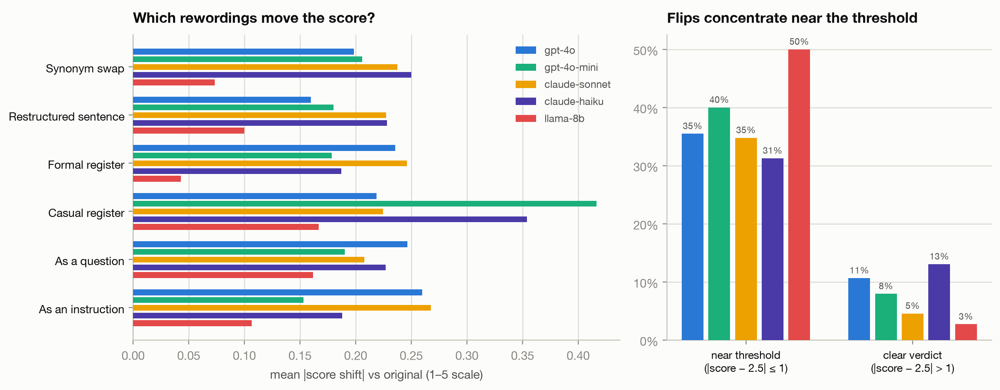

# flakyjudge

**How stable are natural-language unit tests for LLM evals?**

Teams increasingly evaluate LLM outputs with natural-language unit tests —
discrete assertions like *"Does the response cite the refund window?"* scored
by a judge model (LMUnit, TICK, checklist evals). This project measures the
reliability of that paradigm: if you reword the assertion without changing
its meaning, does the verdict change?



**📄 Tech report: [report/report.md](report/report.md)** — methods, all
results, practical guidance, limitations.

> 🚧 Experimental design is frozen in
> [PREREGISTRATION.md](PREREGISTRATION.md). Results cover the two OpenAI
> judges (all four experiments complete); Claude, Gemini, and Qwen judges
> are landing next.

## Early findings

- **Rewording a unit test flips its pass/fail verdict on 20.5% of items
  (gpt-4o; 14.1% gpt-4o-mini)** — ~5× the identical-input resampling noise
  floor (4.0% / 2.0%). Score ICC drops from 0.98 (resampling) to 0.91
  (paraphrase).
- **Criterion wording acts as a hidden decision threshold:** flips
  concentrate ~3× on items whose scores sit near the pass/fail cut
  (29–40%) vs clear verdicts (8–11%).

  
- **The instrument has resolution:** deliberately meaning-*changed*
  controls (negated/swapped criteria) shift scores 3–4× more than true
  paraphrases and flip 2–5× more than any single paraphrase type.

  
- **The classic verbosity bias largely disappears under criterion-anchored
  judging:** padding responses 1.8× (content-matched, claim-audited) moves
  gpt-4o's scores by +0.01 (p=0.96); if anything, gpt-4o *rewards concision*
  (+0.23 for 0.54× condensed variants, p=0.03). Verbosity elasticity is
  slightly negative for both judges. This supports the decomposition
  hypothesis: unit-test framing may shield judges from the length halo
  documented in holistic and pairwise judging.
- **The logprob-weighted scoring trick buys little off-the-shelf:**
  +0.01–0.02 Spearman vs direct digit scoring, CIs crossing zero.
- **Rubrics make judges harsher, not more valid:** appending the FLASK
  rubric+reference shifts scores −0.25 to −0.29 with ~no correlation gain.

## What this is

An empirical robustness study across 6 judge models (Claude, GPT-4o, Gemini,
Qwen families) on FLASK and BiGGen-Bench items, plus a small library
implementing the measurement tools and mitigations:

- **E1** — judge-human correlation anchor; logprob-weighted vs. direct scoring
- **E2** — identical-input noise floor (resampling + field-order stability)
- **E3** — *headline:* paraphrase sensitivity of the unit-test criterion itself
- **E4** — verbosity bias under criterion-anchored judging

Related work measures judge robustness at the *response* level
([Judge Reliability Harness](https://arxiv.org/abs/2603.05399)) and *template*
level; this study targets the *criterion* level — the load-bearing assumption
of the unit-test paradigm ([LMUnit](https://arxiv.org/abs/2412.13091)).

## Reproducibility

Every raw API response (including logprobs) is committed in a
content-addressed cache, so all results and figures regenerate with **zero
API keys and zero dollars**:

```bash
git clone https://github.com/ShivaSankeerth/flakyjudge && cd flakyjudge
uv sync
make cache-unpack   # inflate the committed API-response cache (19MB gz)
make figures
```

## Development

```bash
uv sync --extra dev
make test    # pytest: metrics vs published worked examples, cache, providers
make lint    # ruff
```

## License

MIT
